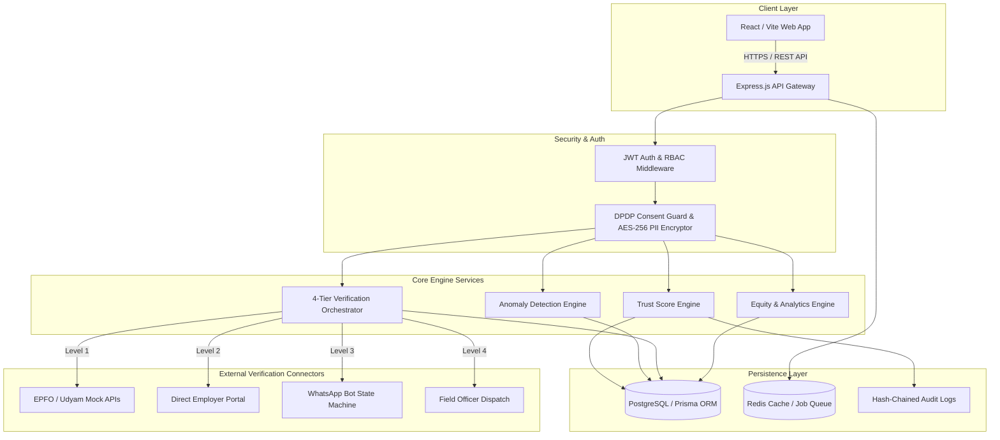

# 🎯TrapRat

> **Government-Grade Skill Outcome Intelligence & Verification Platform**

[](https://nodejs.org/)
[](https://www.typescriptlang.org/)
[](https://reactjs.org/)
[](https://vitejs.dev/)
[](https://www.prisma.io/)
[](https://tailwindcss.com/)
[]()
[](LICENSE)

---

## 📌 Executive Summary

**TrapRat** is an enterprise-grade Skill Outcome Intelligence and Verification Platform engineered to track, authenticate, and analyze vocational training outcomes, employment claims, and wage progressions across India.

By replacing raw Aadhaar identifiers with anonymized Skill Outcome IDs, integrating an explainable **0-100 Trust Score engine**, deploying a **4-tier signal-first verification ladder**, and enforcing **DPDP Act 2023 consent standards**, Kaushal Sankalp brings transparency, fraud mitigation, and data integrity to large-scale skill development initiatives.

---

## 🏗️ System Architecture



---

## 🔥 Key Platform Capabilities

### 1. 🛡️ Explainable Trust Score Engine (0–100)
A dynamic, multi-factor scoring model that rates the credibility of every employment outcome:
- **Base Score**: Granted upon outcome registration.
- **Verification Bonuses**: Points earned for document authentication and direct employer confirmation.
- **Recency & Consistency Bonuses**: Rewards recent, stable employment records.
- **Anomaly Penalty**: Automatic deductions triggered by the anomaly engine.

### 2. 📶 4-Tier Signal-First Verification Ladder
Gradual escalation workflow minimizing manual audit overhead:
- **Level 1 (Automated APIs)**: Instant verification against mock EPFO (provident fund) and Udyam (MSME) registries.
- **Level 2 (Employer Confirmation)**: One-click token-gated verification sent directly to HR/Employers.
- **Level 3 (Interactive Bot)**: Automated WhatsApp state-machine verification with trainees.
- **Level 4 (Field Officer Dispatch)**: On-ground physical verification assigned only when lower levels fail or flag high anomaly risk.

### 3. 🚨 Automated Anomaly Detection Engine
Evaluates 10+ strict heuristic rules to eliminate fraud:
- Duplicate document hash detection across trainees.
- Physically impossible employment timelines.
- Bulk employer confirmations originating from single IP/timestamps.
- Concurrent full-time employment claims across multiple providers.
- Duplicate batch detail registrations.

### 4. 🔒 DPDP Act 2023 & Anonymized Trainee Registry
- **Anonymized IDs**: Trainees receive unique, non-reversible `KSL-YYYY-XXXXX` identifier tokens (never raw Aadhaar numbers).
- **AES-256-GCM Encryption**: All Personally Identifiable Information (PII) like phone numbers and emails are encrypted at rest.
- **Purpose-Bound Consent**: Instant consent withdrawal automatically suppresses PII and cancels queued follow-up workflows.

### 5. 📊 Equity Analytics & Context-Adjusted Metrics
- Disparity reporting across Gender, Caste (SC/ST/OBC), Regional geography, and Disability status.
- **Small-Cell Suppression**: Hides small demographic samples ($n < 10$) to preserve individual anonymity.
- **Skill-Gap Analysis**: Compares market demand with course syllabi to generate quarterly policy advisory reports.

### 6. 📜 Cryptographic Hash-Chained Audit Trail
- Every critical data write, score recalculation, and status change is appended to a tamper-evident hash chain for auditability.

---

## 🔑 Demo Seed Accounts

Use these pre-configured credentials to test different role-based views in the application:

| Role | Email | Password | Scope & Permissions |
|---|---|---|---|
| 👑 **System Admin** | `admin@kaushalsankalp.gov.in` | `Admin@123` | Full System Access, Anomaly Review, Analytics & Audit Logs |
| 🏢 **Provider Admin (Pune)** | `admin@puneskills.org` | `Admin@123` | Training Provider Dashboard, Trainee Enrolment & Batch Mgmt |
| 🏢 **Provider Admin (Mumbai)** | `admin@skillcraft.edu.in` | `Admin@123` | Training Provider Dashboard (Mumbai Center) |
| 🕵️ **Field Officer** | `officer@skills.gov.in` | `Admin@123` | On-Ground Verification, Document Review & Trainee Verification |
| 🎓 **Trainee** | `trainee@kaushalsankalp.gov.in` | `Admin@123` | Public Portal, Self Claim Verification & Evidence Submission |

---

## ⚡ Quick Start & Local Setup

### Prerequisites
- **Node.js**: `v18.0.0` or higher
- **npm**: `v9.0.0` or higher
- **Git**

---

### 1. Backend Service Setup

```bash
# Navigate to backend directory
cd backend

# Install dependencies
npm install

# Setup environment variables (copy example file)
cp .env.example .env

# Run database migrations & seed rich test data (40+ trainees, 10 batches, anomalies)
npm run prisma:seed

# Start dev backend server (runs on http://localhost:3000)
npm run dev
```

To run the backend test suite:
```bash
npm test
```

---

### 2. Frontend Application Setup

```bash
# Navigate back to root directory
cd ..

# Install dependencies
npm install

# Start Vite dev server (runs on http://localhost:5173)
npm run dev
```

Open `http://localhost:5173` in your browser.

---

## 📡 API Reference Overview

| Category | Endpoint | Method | Access Level | Description |
|---|---|---|---|---|
| **Auth** | `/api/auth/login` | `POST` | Public | Authenticates user & returns JWT tokens |
| **Auth** | `/api/auth/register` | `POST` | Public | Registers new user account |
| **Trainees** | `/api/trainees` | `GET`, `POST` | Admin / Provider | Manage trainee records & Skill Outcome IDs |
| **Trainees** | `/api/trainees/:id/claim-record` | `POST` | Public (OTP) | Public portal claim submission |
| **Providers** | `/api/providers` | `GET`, `POST` | Auth | View & register training providers |
| **Outcomes** | `/api/outcomes` | `GET`, `POST` | Auth | Employment & placement outcomes |
| **Outcomes** | `/api/outcomes/:id/verify` | `POST` | Admin / Officer | Manually verify employment outcome |
| **Outcomes** | `/api/outcomes/:id/recalculate-trust-score` | `POST` | Admin | Trigger Trust Score engine recalculation |
| **Employers** | `/api/employers/:id/send-verification-link` | `POST` | Auth | Dispatches token-gated verification email |
| **Public** | `/api/public/verify/:token` | `GET`, `POST` | Public (Token) | Employer verification portal endpoint |
| **Anomalies** | `/api/anomalies` | `GET` | Admin | Review automated system flags & alerts |
| **Analytics** | `/api/analytics/equity` | `GET` | Admin | Fetch context-adjusted equity scorecards |
| **Analytics** | `/api/analytics/skill-gaps` | `GET` | Auth | Fetch industry demand vs syllabus reports |
| **Audit** | `/api/audit-logs` | `GET` | Admin | Inspect tamper-evident system logs |

---

## 🐳 Docker Deployment

Run the complete platform (PostgreSQL database, API, and Frontend) in containerized isolation:

```bash
docker compose up --build -d
```

- **Frontend App**: `http://localhost:5173`
- **Backend API**: `http://localhost:3000`

---

## 📜 License

This project is licensed under the [MIT License](LICENSE).

---

<p center>
Built with ❤️ for <b>Skill Development & Transparency in Governance</b>
</p>
